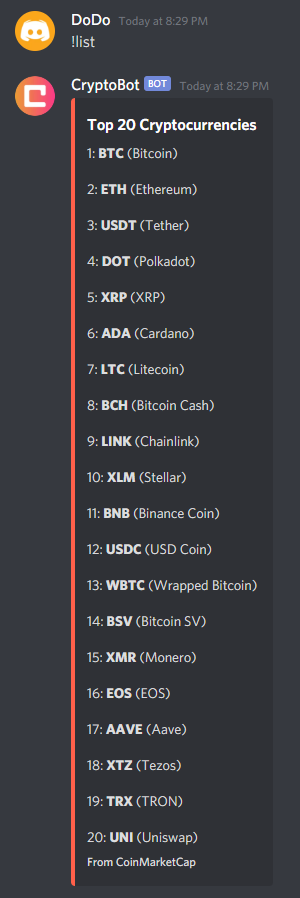
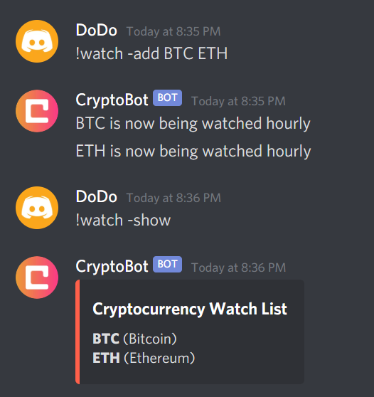
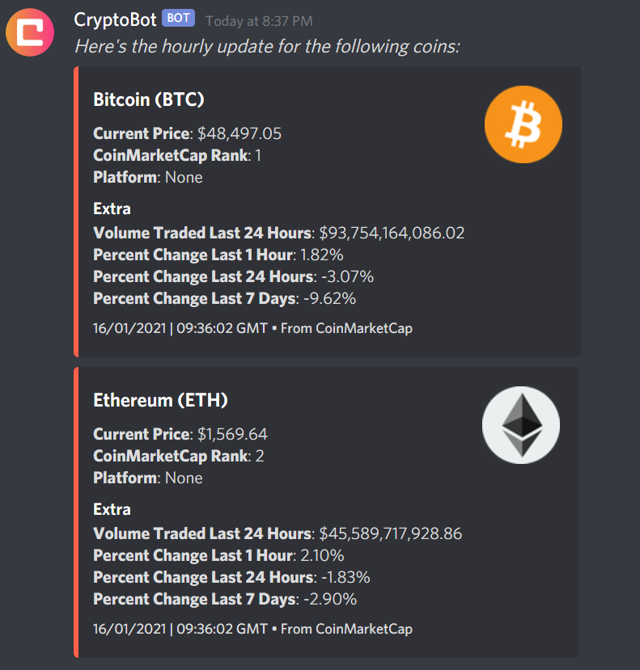
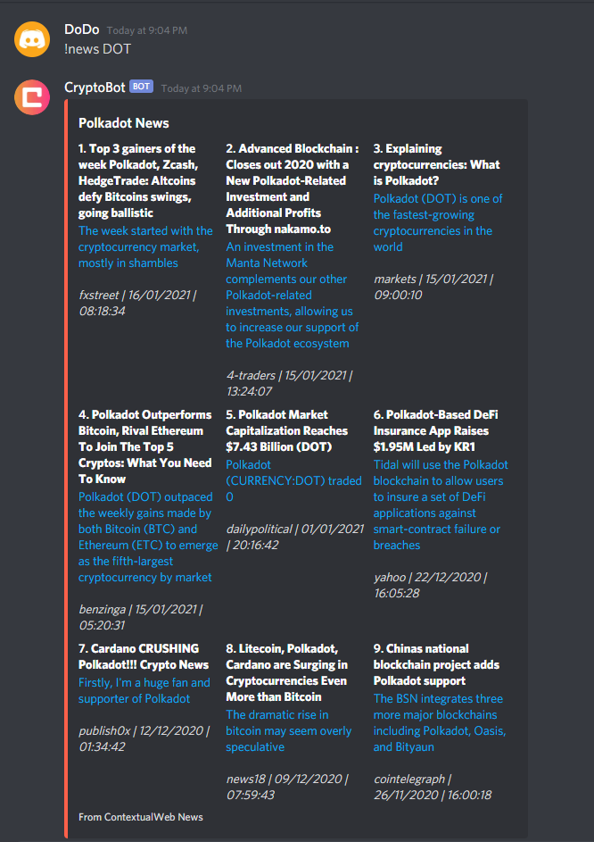
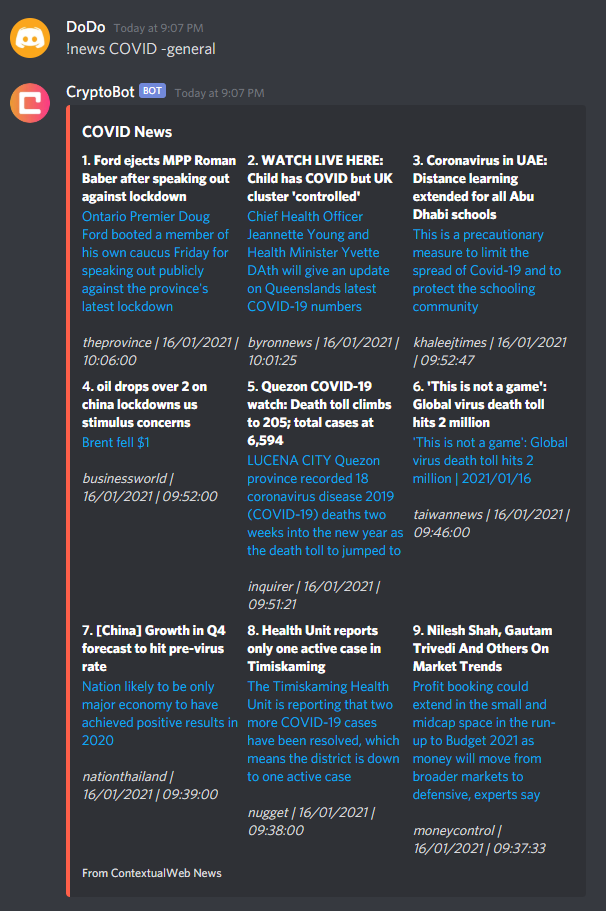
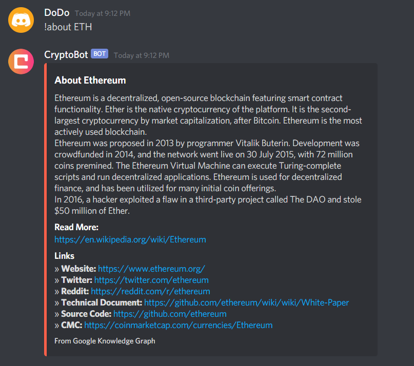
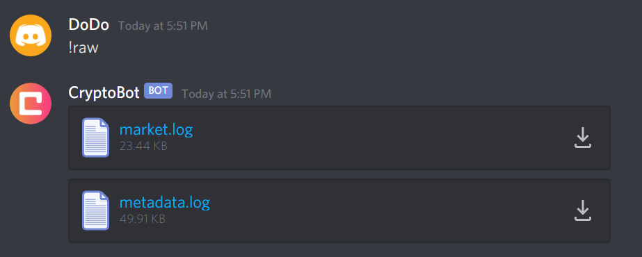

</br>
</br>
<p align="center" >
  
</p>
</br>

# CryptoBot

CryptoBot is an open source cryptocurrency bot for Discord which automates the process of obtaining economic
information about cryptocurrencies and tracking their individual market performance. 

It was initially created as a side project to make cryptocurrency investment and learning more convenient, whilst furthering my knowledge of
API integration, database management, and system design. See the *Setting up your own Cryptocurrency Bot* section below to host your own discord bot using this code.

## Features
CryptoBot is able to:
* Retrieve and display real-time financial information for individual cryptocurrencies, including:
    - Price
    - Rank
    - Platform
    - Daily Volume Traded
    - Percentage Changes (Hourly, 7 Hourly, Daily)
    - Market Cap
    - Max, Circulating and Total Supply
* Display background information about each cryptocurrency, as well as providing relevant links to 
official websites, financial information websites, social media pages, and technical documents 
* Retrieve and display the top nine trending news articles for a specified cryptocurrency, or any general economic news
    - Includes a tri-daily news feed to remain updated on the latest general cryptocurrency news
* Track multiple chosen cryptocurrencies and provide hourly updates on their performance
* Be set to notify individual users when chosen cryptocurrencies exceed/fall below a specified price

## Commands

### Command List

| Command       | Arguments         
| ------------- |:-------------:   
| !crypto       | [symbol] [param]  
| !list         |      N/A            
| !watch        | [param] [symbols...] 
| !ping         | [symbol] [> OR <] [price]
| !news         | [symbol/phrase] [-general]
| !newsfeed     | [symbol/phrase] [-general]
| !about        | [symbol]
| !post         | [channel ID]
| !raw          |      N/A
</br>

### Descriptions
</br>

## !crypto [symbol] [param]

Displays financial information surrounding a cryptocurrency, 
with the depth of information depending on the parameter given
(None, -extra, -supply, -links, -all)
* With no parameter, only price, rank and platform will be shown
* Use '-extra' to show daily volume traded, and percentage changes
* Use '-supply' to show market cap and supply information
* Use '-links' to show relevant links
* Use '-all' to show all the above information

### Example:

**!crypto BTC -all**

</br>
</br>
<p align="center" >
  
</p>
</br>

## !list

Provides a list of the top 20 cryptocurrencies (ranked by market cap)

### Example:

**!list**

</br>
</br>
<p align="center" >
  
</p>
</br>

## !watch [param] [symbols...]

Add/Remove cryptocurrencies to/from a watch list.
The bot will provide hourly updates on the currencies in this watch list.
* Use '-add' [symbols...] to add symbols to the watch list
* Use '-remove' [symbols...] to remove symbols from the watch list
* Use '-show' to show the watch list

### Example:
 
**!watch -add BTC ETH**

**!watch -show**

</br>
</br>
<p align="center" >
  
</p>
</br>
<p align="center" >
  
</p>
</br>

## !ping [symbol] [> OR <] [price]

Add/Remove cryptocurrencies to/from a notification list, 
as well as specifying a price and a higher/lower comparison parameter.
The bot will notify you if the price of a chosen cryptocurrency
exceeds/falls below your chosen price.
* Use '>' if you want to be notified if the currency exceeds a price
* Use '<' if you want to be notified if the currency falls below a price
  
### Example:

**!ping BTC > 25000**

</br>
<p align="center" >
  
</p>
</br>
<p align="center" >
  
</p>
</br>

## !news [symbol/phrase] [-general]

Provides the top 9 trending news articles surrounding 
either a specified cryptocurrency, or a general phrase.
* Use '-general' at the end of any word/phrase that isn't a cryptocurrency symbol

### Example:

**!news DOT**

</br>
<p align="center" >
  
</p>
</br>

**!news COVID -general**

</br>
<p align="center" >
  
</p>
</br>

## !newsfeed [symbol/phrase] [-general]

Sets the tri-daily automated news feed to provide news about a cryptocurrency
or custom phrase (the default is 'Cryptocurrency').

### Example:

**!newsfeed BTC**

## !about [symbol]

Displays information about a specified cryptocurrency, as well as a link to read more, and other relevant links.

### Example:

**!about ETH**

</br>
<p align="center" >
  
</p>
</br>

## !raw

Sends the raw market data and metadata for the last !crypto call as text files

### Example:

**!raw**

</br>
<p align="center" >
  
</p>

#

</br>
<p align="center">
  <!--  -->
  
</p>
</br>

#

## APIs 

* [CoinMarketCap API](https://coinmarketcap.com/api/documentation/v1/)
* [Google Knowledge Graph API](https://developers.google.com/knowledge-graph/?hl=en_US)
* [ContextualWeb News API](https://contextualweb.io/news-api/) 

## Setting up your own Cryptocurrency Bot

1. Head to the [Discord Developer Portal](https://discord.com/developers/applications), and [create a new bot application.](https://discordpy.readthedocs.io/en/latest/discord.html)
2. Create an [invite URL](https://discordpy.readthedocs.io/en/latest/discord.html#inviting-your-bot) for the bot, and copy/paste this into a browser to add the bot to a server.
3. Clone this repository.
4. Sign up for each of the API's above (using any pricing plan, however consider the data request quotas), and obtain API keys.
5. Go to the [MongoDB Cloud Atlas](https://www.mongodb.com/cloud/atlas) and follow the steps to generate a cluster, database and collection. Obtain the URI for this collection. Based on what the Database and Collection are named, change the following lines in crypto.py, replacing the names *CryptoBot* and *GuildData* with the names of the database and it's collection respectively:
```
db = cluster["CryptoBot"]
collection = db["GuildData"]
```
6. Navigate to /src, and fill in the .env template with the Bot Token, API Keys and MongoDB URI (the curly braces should also be removed).
```
DISCORD_TOKEN={Insert Bot Token}
CMC_API_KEY={Insert CoinMarketCap API Key}
GOOGLE_API_KEY={Insert Google Knowledge Graph API Key}
NEWS_API_KEY={Insert ContextualWeb News API Key}
MONGODB_URI={Insert MongoDB Database URI}
```
7. From within /src, run:
```
pip install -r ../requirements.txt
```
8. From within /src, run the following to start the bot:
```
python crypto.py
```


